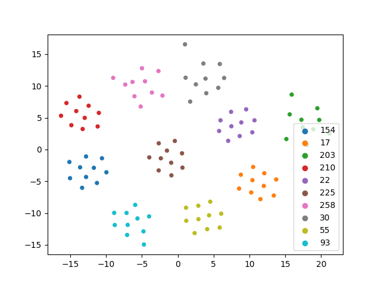

# D-vector

This is a PyTorch implementation of speaker embedding trained with GE2E loss.
The original paper about GE2E loss could be found here: [Generalized End-to-End Loss for Speaker Verification](https://arxiv.org/abs/1710.10467)

## Usage

Since the d-vector is compiled with TorchScript, you can simply load and use the pretrained d-vector anywhere.

```python
import torch
from modules import AudioToolkit

wav = AudioToolkit.preprocess_wav(audio_path)
mel = AudioToolkit.wav_to_logmel(wav)
mel = torch.FloatTensor(mel)

with torch.no_grad():
    dvector = torch.jit.load(checkpoint_path).eval()
    emb = dvector.embed_utterance(mel)
```

## Train from scratch

### Preprocess training data

To use the script provided here, you have to organize your raw data in this way:

- all utterances from a speaker should be put under a directory (**speaker directory**)
- all speaker directories should be put under a directory (**root directory**)
- **speaker directory** can have subdirectories and utterances can be placed under subdirectories

And you can extract utterances from multiple **root directories**, e.g.

```bash
python preprocess.py VoxCeleb1/dev LibriSpeech/train-clean-360 -o preprocessed
```

### Train a model

You have to specify where to store checkpoints and logs, e.g.

```bash
python train.py preprocessed <model_dir>
```

During training, logs will be put under `<model_dir>/logs` and checkpoints will be placed under `<model_dir>/checkpoints`.
For more details, check the usage with `python train.py -h`.

### Visualize speaker embeddings

You can embed utterances of several speakers, e.g.

```bash
python visualize.py <speakers_dir> -c dvector.pt -o tsne.jpg
```

The dimension reduction result (using t-SNE) of some utterances from LibriSpeech.



## References

- GE2E-Loss module: [cvqluu/GE2E-Loss](https://github.com/cvqluu/GE2E-Loss)
- Audio preprocessing: [resemble-ai/Resemblyzer](https://github.com/resemble-ai/Resemblyzer)
